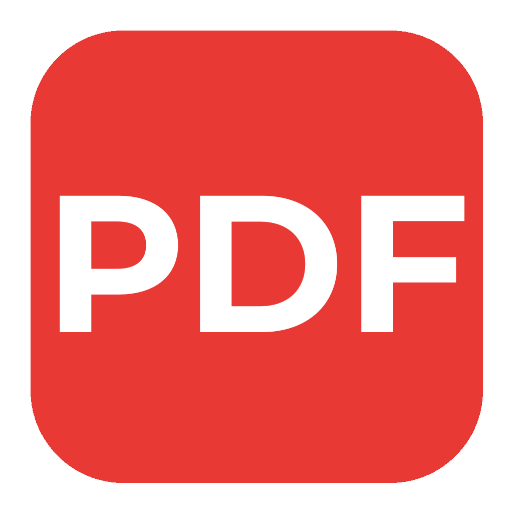
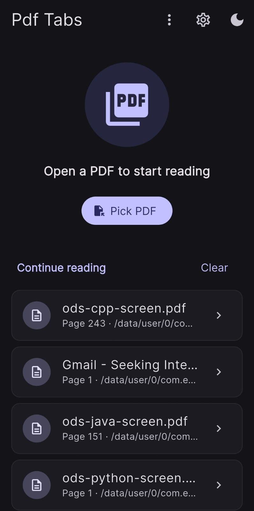
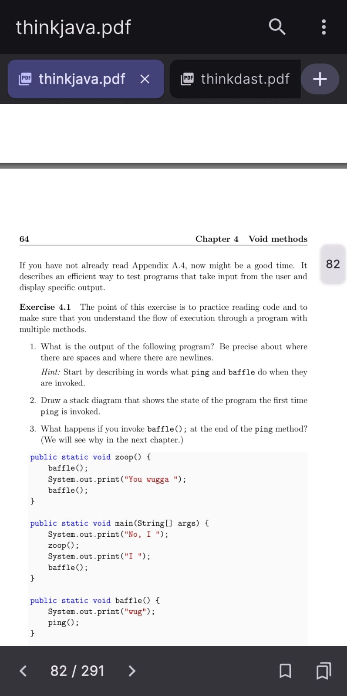
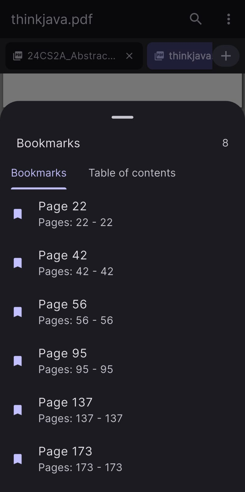
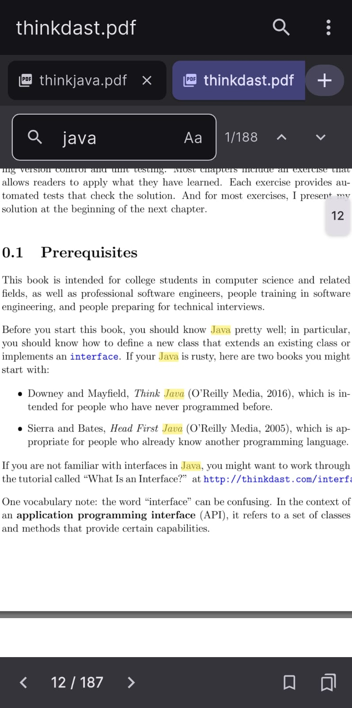
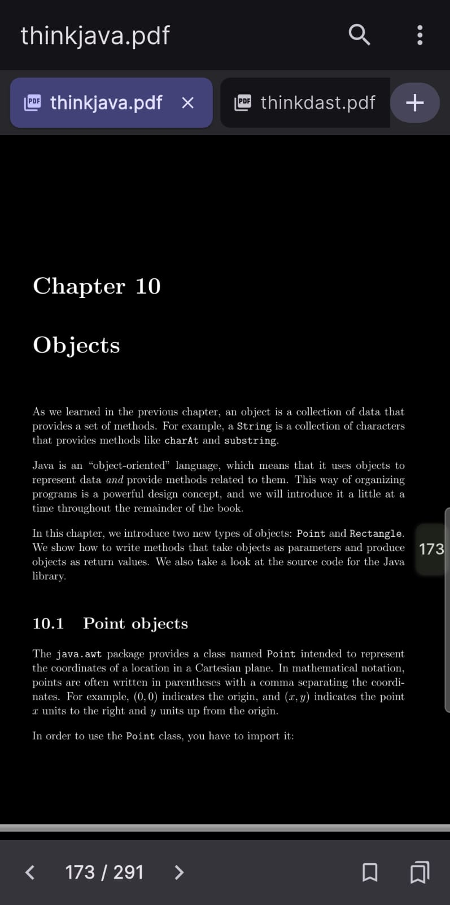

<p align="center">
  
</p>

<h1 align="center">Pdf Tabs</h1>

<p align="center">
  A modern, multi-tab PDF reader built with Flutter.<br/>
  Read, search, bookmark, and manage your PDFs — all in one place.
</p>

<p align="center">
  <a href="https://github.com/hariraja-07/pdf-tabs/releases"></a>
  <a href="https://flutter.dev"></a>
  <a href="https://dart.dev"></a>
  <a href="LICENSE"></a>
</p>

---

## Demo

<p align="center">
  
</p>

---

## Screenshots

<table align="center">
  <tr>
    <td align="center"><b>Home</b></td>
    <td align="center"><b>PDF Viewer</b></td>
    <td align="center"><b>Bookmarks</b></td>
  </tr>
  <tr>
    <td></td>
    <td></td>
    <td></td>
  </tr>
  <tr>
    <td align="center"><b>Search</b></td>
    <td align="center"><b>Dark Reader</b></td>
    <td></td>
  </tr>
  <tr>
    <td></td>
    <td></td>
    <td></td>
  </tr>
</table>

---

## Features

- **Multi-tab reading** — open multiple PDFs and switch between them
- **In-app search** — find text with match highlighting, case-sensitive toggle, and next/previous navigation
- **Bookmarks** — star any page for quick access; bookmarks persist across sessions
- **Table of contents** — navigate PDFs with embedded outlines
- **Dark reader mode** — invert PDF colors for comfortable low-light reading
- **Reading history** — resume where you left off from the home screen
- **Page navigation** — jump to any page with a tap counter or next/previous controls
- **Fullscreen mode** — hide all chrome for an immersive reading experience
- **Share PDFs** — share the current file via any installed app
- **Share-to-open** — send PDFs from other apps directly into Pdf Tabs
- **Theme modes** — light, dark, or follow system settings
- **Localization** — English UI with i18n support

---

## Tech Stack

| Layer | Technology |
|---|---|
| Framework | [Flutter](https://flutter.dev) |
| State management | [Riverpod](https://riverpod.dev) (v2.6) |
| PDF rendering | [pdfrx](https://pub.dev/packages/pdfrx) (v2.4) |
| Persistence | [SharedPreferences](https://pub.dev/packages/shared_preferences) |
| File picking | [file_picker](https://pub.dev/packages/file_picker) |
| Sharing | [share_plus](https://pub.dev/packages/share_plus) + [receive_sharing_intent](https://pub.dev/packages/receive_sharing_intent) |
| Theming | Material 3 with [google_fonts](https://pub.dev/packages/google_fonts) |

---

## Architecture

```
lib/
  core/theme/         # App-wide theme (light, dark, system)
  features/
    bookmarks/        # Bookmark provider + persistence
    home/             # Home screen, recent files, reading history
    pdf_viewer/       # PDF viewer, navigation bar, search, bookmarks sheet
    settings/         # Settings screen, dark reader toggle
    tabs/             # Multi-tab provider, tab strip, tabbed screen
  l10n/               # Localization (English)
  main.dart           # Entry point, sharing intent, lifecycle hooks
```

- **Riverpod** providers for all state (bookmarks, tabs, settings, recent files)
- **Feature-based** folder structure for clean separation of concerns
- **SharedPreferences** for durable persistence across sessions
- **AsyncNotifier** pattern for async state (bookmarks, settings, recent files)

---

## Getting Started

### Prerequisites

- [Flutter SDK](https://flutter.dev/docs/get-started/install) 3.x
- Dart SDK 3.11+

### Run the app

```sh
flutter pub get
flutter run
```

### Run tests

```sh
flutter test
```

### Generate launcher icons

```sh
dart run flutter_launcher_icons
```

---

## Platforms

| Platform | Status |
|---|---|
| Android | Supported (tested on physical device) |
| iOS | Supported |

> Other platforms (Linux, macOS, Windows, Web) are not yet supported.

---

## License

This project is licensed under the MIT License — see the [LICENSE](LICENSE) file for details.
